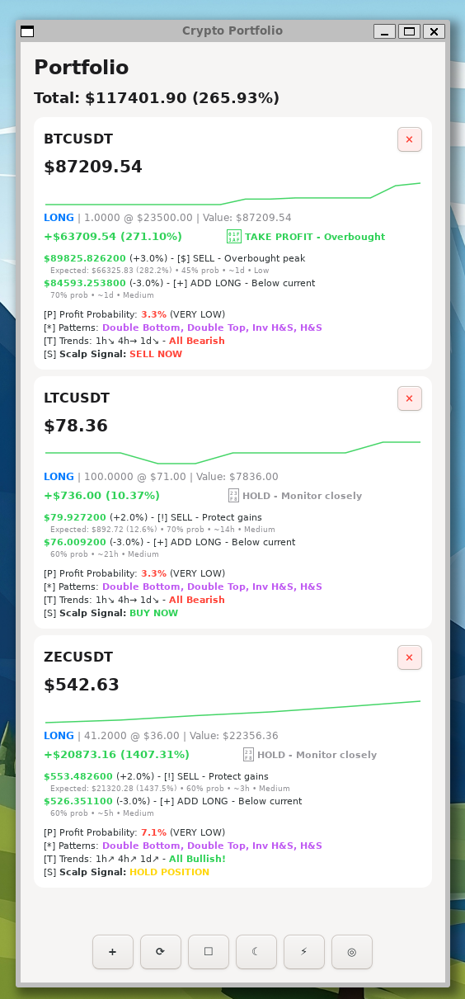

# Tradegenie2

Tradegenie2 is a real-time cryptocurrency portfolio tracker and trading analysis tool built with GTK3. It provides live market data, multi-timeframe technical analysis, and automated scalping bot capabilities for discretionary traders.

## Availability

A commercial build for Windows 10/11 is available at https://github.com/kaiikigai/tradegenie2 and on sharepanda.org to support this work.

## Help Us Grow This Community

If Tradegenie2 has helped improve your trading or taught you valuable skills, please consider:

**Sharing with others:** Post about this tool on Twitter, Reddit, or your favorite crypto communities. Tag us and let others know how it's helped you.

**Star this repository:** Click the star button at the top of this page to help others discover this project.

**Join the conversation:** Share your trading insights, strategies, and success stories. Connect with other traders learning to navigate the markets.

**Contribute:** Whether you're a developer, trader, or enthusiast, your feedback and contributions help make this tool better for everyone.

**Support development:** If this app has added value to your trading journey, you can donate using the Bitcoin address below or scan the QR code.

bc1qqn23zg7p62lpkw3flnt59wgd8d9f5h8grypf7y


## For Learning Traders

This project is perfect for those who want to understand technical analysis and algorithmic trading. The open source code provides real examples of how indicators like MACD, RSI, and Bollinger Bands are calculated and used in actual trading decisions. Study the bot logic to see how automated strategies execute trades based on market signals. Join our growing community of traders who are learning, sharing strategies, and supporting each other's growth in the crypto markets.




## Features

### Portfolio Management
Track multiple cryptocurrency positions with real time price updates from Binance API. Support for both long and short positions with automatic profit/loss calculation. Portfolio data persists between sessions and updates on refresh.

### Technical Analysis
Multi timeframe analysis across 5m, 15m, 1h, 4h, and 1d intervals with comprehensive indicator suite including EMA (12, 26, 50, 200), MACD with signal line and histogram, Bollinger Bands, and RSI. Pattern recognition detects double tops, double bottoms, head and shoulders, and inverse head and shoulders formations.

### Scalping Bot System
Automated trading bots execute buy/sell decisions based on 5m and 15m timeframe signals. Each bot tracks trade history, win/loss ratios, total fees, drawdown, and ROI. Bots can be started, stopped, paused, or reset individually. Fee structure uses 0.1% maker/taker fees consistent with major exchanges.

### Market Signals
Realtime trend analysis using multi timeframe confirmation across all loaded intervals. Momentum scoring based on price velocity and volatility measurements. Probability calculations for target price achievement with estimated timeframes. Support and resistance level identification from historical price action.

### Performance Analytics
Portfolio wide performance metrics including total value, cost basis, and profit/loss percentages. Individual position analysis with trend indicators and momentum scores. Color coded recommendations based on technical confluence.

## Technical Architecture

### Data Layer
Core portfolio engine manages up to 10 concurrent trading pairs with 20point price history buffers per pair. Historical data caches maintain 288 5m candles, 192 15m candles, 500 1h candles, 200 4h candles, and 100 daily candles. Network layer uses libsoup for async HTTP requests to Binance REST API with JSON-C for response parsing.

### Calculation Engine
EMA calculations use exponential smoothing with 2/(n+1) multiplier. MACD derives from 12/26 EMA differential with 9-period signal line. Bollinger Bands employ 20-period SMA with 2 standard deviation bands. RSI computation follows standard Wilder smoothing method. All indicators update automatically when new candle data loads.

### Bot Engine
Scalping bots maintain independent balance tracking with configurable trade amounts in USD. Position management tracks average entry price and current holdings. Trade records store timestamp, price, quantity, fees, and resulting balance. Statistics engine calculates win rate, total profit, and maximum drawdown. Bots persist state to disk and restore on application restart.

### User Interface
GTK3 based interface with responsive price updates and tabbed navigation. Portfolio view displays all positions with live P/L calculations. Bot management panel controls up to 5 concurrent scalping bots. color coded visual feedback for trade signals and performance metrics.

## Compilation

### Dependencies

Ubuntu/Debian:
```bash
sudo apt-get update
sudo apt-get install -y build-essential pkg-config libgtk-3-dev libsoup2.4-dev libjson-c-dev
```

Fedora:
```bash
sudo dnf install -y gcc pkg-config gtk3-devel libsoup-devel json-c-devel
```

Arch Linux:
```bash
sudo pacman -S --noconfirm gcc pkg-config gtk3 libsoup json-c
```

Or use the Makefile convenience target:
```bash
make install-deps          # Ubuntu/Debian
make install-deps-fedora   # Fedora
make install-deps-arch     # Arch Linux
```

### Build Instructions

Compile the application:
```bash
make
```

The compiled binary will be located at `bin/gticker_portfolio`.

Build with debug symbols:
```bash
make debug
```

Clean build artifacts:
```bash
make clean
```

### Running

Execute the application directly:
```bash
./bin/gticker_portfolio
```

Or build and run in one command:
```bash
make run
```

### Package Building

Build Debian package for Ubuntu 22.04 (requires Docker):
```bash
make deb
```

Build for all Ubuntu versions:
```bash
make deb-all
```

## Usage

### Adding Positions
Click the Add button to create a new portfolio entry. Enter the trading pair symbol in uppercase format (e.g., BTCUSDT, ETHUSDT). Specify entry price, quantity, and position type (long or short). The application fetches current price and historical data automatically.

### Monitoring
The main view displays all positions with current price, entry price, quantity, and profit/loss. Color coding indicates performance: green for profitable positions, red for losses. Refresh button updates all prices and re-analyzes technical indicators across all timeframes.

### Technical Analysis
Each position displays trend direction, momentum score, and detected chart patterns. Multi-timeframe analysis shows alignment across 5m through 1d intervals. Target price analysis provides probability estimates and expected timeframes for reaching specified price levels. Support and resistance levels calculate from recent price action to identify key trading zones.

## Data Storage

Portfolio data saves to `$HOME/.config/gticker/portfolio.json` on Linux. Bot state persists to `$HOME/.config/gticker/bots.json`. All data auto-saves on position changes and application exit.

## API Usage

Application connects to Binance public API endpoints. No API keys required for price data and historical candles. Rate limits apply per Binance public API policies. Network errors display in console output but do not crash the application.

## Project Structure

The repository keeps shared headers in include, native sources in src, executable artifacts in bin, and build outputs in build so each layer of the toolchain stays clear.

## License

Tradegenie2 is released under the GNU General Public License version 2 only. See the LICENSE file for the complete terms.
